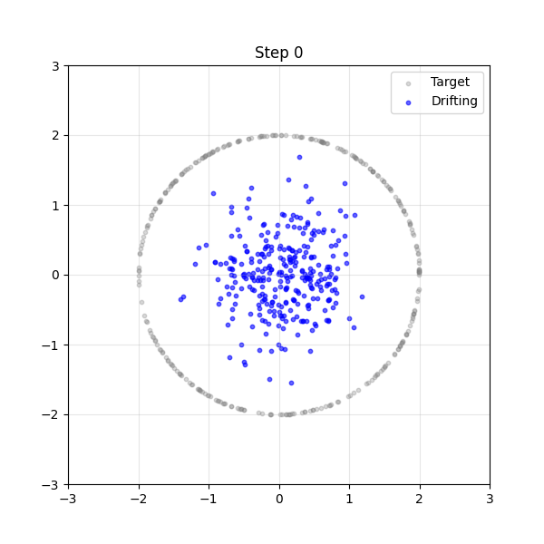
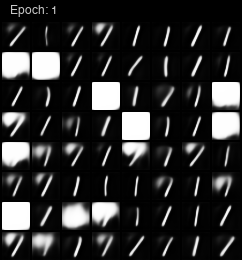

# Learning MNIST with Drifting Models

<p align="center">
  
  
</p>

This is a very basic implementation of Drifting Models, following the paper [Generative Modeling via Drifting](https://arxiv.org/pdf/2602.04770), on the example of the MNIST dataset.

> **TL;DR:** Drifting Models evolve the pushforward distribution $q_\theta \sim f_\theta(X), X \sim N(0, 1)$ of a model by repeatedly applying an anti-symmetric forcing field $V_{q,p}$ to it which *drifts* the distribution towards the data distribution $p$ that we want to learn. We solve the fix-point problem
> 
> $$f_\theta(X) =_d f_\theta(X) - V(f_\theta(X))$$
> 
> by minimizing
> 
> $$f_\theta(\hat{X}) - \text{stopgrad}(f_\theta(\hat{X}) + V_{q,p}(f_\theta(\hat{X})))$$
> 
> where $\hat{X} \leftarrow N(0,1)^D$. The system is in an equilibrium where the forcing field is zero which is necessarily the case whenever $q_\theta = p$ by anti-symmetry. The forcing field used in this repository is given by
> 
> $$V_{q,p}(x) = V_{q,p}^+(x) - V_{q,p}^-(x)$$
> 
> $$V_{q,p}^+(x) = \mathbb{E}_{y_+ \sim p}[k(x,y_+) (y_+ - x)]$$
> 
> $$V_{q,p}^-(x) = \mathbb{E}_{y_- \sim q}[k(x,y_-) (y_- - x)]$$
> 
> with the kernel function
> 
> $$k(x,y) = e^{-\frac{\|x-y\|_2}{\tau}}$$
> 
> Effectively, $V^+$ attracts the pushforward distribution towards the data distribution and $V^-$ repels it from itself to prevent the distribution from collapsing on itself.
> 
> The main advantage of this method is that the resulting model generates samples in a single step while being competitive with multi-step methods like diffusion models on several tasks.

# Usage

The entry point is the `main.py` file which accepts two subcommands: `train` and `sample`. The former trains the model and the latter samples from it.

**Training**

To train the model, run the following command:

```bash
python main.py train --epochs 100 --batch-size 512 --lr 1e-3
```

Training stats are logged via tensorboard and can be visualized by running the following command:

```bash
tensorboard --logdir runs
```

**Sampling**

To sample from the model, run the following command:

```bash
python main.py sample --model_path runs/<run-name>/model_final.pth --batch_size 1
```


# References

- [Generative Modeling via Drifting](https://arxiv.org/pdf/2602.04770)
